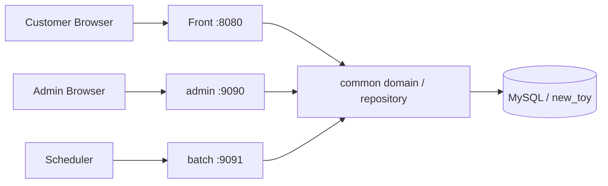
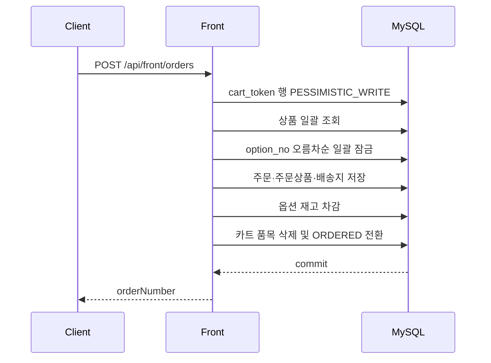

# Grade Stock

상품 탐색부터 재고 기반 주문, 관리자 운영, 콘텐츠 분석, 예약 배치까지 하나의 도메인으로 연결한 Spring Boot 멀티 모듈 커머스 프로젝트입니다.

Grade Stock은 화면 시연에만 머무르지 않고 다음 운영 과제를 함께 다룹니다.

- 서버 페이징과 동적 검색 조건을 사용하는 고객용 카탈로그
- 옵션 재고를 기준으로 한 장바구니와 비회원 주문
- 상품, 주문, 회원, 배너, 콘텐츠를 관리하는 관리자 백오피스
- 콘텐츠 조회·반응 데이터를 운영 작업으로 전환하는 분석 흐름
- 통계 집계와 데이터 보존 정책을 실행하는 독립 배치

> 현재 주문은 결제 대행사와 연동되지 않은 주문 접수 단계입니다. 실제 결제, 회원 계정, 외부 배송 추적은 구현 범위에 포함되지 않습니다.

## Architecture



| 모듈 | 역할 | 실행 여부 |
| --- | --- | --- |
| `Front` | 카탈로그, 상품 상세, 콘텐츠, 장바구니, 체크아웃, 비회원 주문 조회 | `8080` |
| `admin` | 상품·주문·회원·전시·콘텐츠·운영 설정 관리 | `9090` |
| `batch` | 문서 통계 집계와 조회 이벤트 보존 작업 | `9091` |
| `common` | 공통 엔티티, Spring Data JPA, QueryDSL 조회 구현 | 라이브러리 |

실행 모듈은 모두 `common`을 의존하지만 서로 직접 의존하지 않습니다. 화면별 Controller와 응답 DTO는 각 실행 모듈이 소유하고, 공통 도메인과 조회 계층만 공유합니다.

## Core Features

### Storefront

- 브랜드, 카테고리, 가격, 재고 상태, 검색어 기반 상품 탐색
- 신규 드롭, 랭킹, 빠른 확인 등 독립 컬렉션 화면과 서버 페이징
- 상품 옵션 재고, 연관 상품, 최근 본 상품, 관심·비교 보드
- 공개 공지·에디토리얼 목록, 상세, 조회 집계, 독자 반응
- 브라우저 토큰 기반 장바구니, 배송지 입력, 비회원 주문 접수
- 주문번호와 전화번호 검증을 사용하는 비회원 주문·배송 상태 조회

### Admin

- 상품, 옵션, 브랜드, 카테고리, 프론트 전시 순위 관리
- 주문 상태, 배송 정보, 관리자 메모, 변경 이력 관리
- 회원, 관리자, 배너, 운영 공지, 시스템 설정 관리
- 콘텐츠 CRUD, CSV 내보내기, 조회·반응·성과 분석
- 콘텐츠 성과 이슈의 운영 작업 생성, 회복 완료, 담당자 자동 배정
- 관리자 세션 인증, 로그인 시도 제한, PBKDF2 비밀번호 해시

### Batch

- 게시판 범위별 문서 일일 통계 집계
- 조회 이벤트의 고아 데이터와 보존 기간 만료 데이터 정리
- 환경변수로 작업 활성화, Cron, 보존 기간 제어

## Order Consistency

주문 생성은 하나의 트랜잭션에서 아래 순서로 처리합니다.



- 카트 행 잠금으로 같은 토큰의 중복 체크아웃을 직렬화합니다.
- 수량 변경과 개별·전체 삭제도 같은 잠금 경계에서 처리해 체크아웃과 동시에 변경되지 않도록 합니다.
- 옵션 행은 번호 오름차순으로 한 번에 잠가 다중 상품 주문의 교착 가능성을 낮춥니다.
- 재고 차감, 주문 저장, 카트 완료는 같은 트랜잭션이므로 일부 단계만 반영되지 않습니다.
- 완료된 카트는 다음 상품 추가 시 품목을 비우고 `ACTIVE`로 재사용합니다.
- 주문 조회 전화번호는 URL이 아닌 POST 본문으로 전송하며, 클라이언트 주소별 5분간 10회로 제한합니다.

## Tech Stack

| 구분 | 기술 |
| --- | --- |
| Language | Java 21 |
| Framework | Spring Boot 3.5.4 |
| Persistence | Spring Data JPA, Hibernate |
| Query | OpenFeign QueryDSL 6.11 |
| View | Thymeleaf, Vanilla JavaScript, CSS |
| Database | MySQL |
| Build / Test | Gradle Wrapper, JUnit 5, AssertJ, Mockito |

## Project Layout

```text
Toy/
├── Front/                  # 고객 화면과 공개 API
├── admin/                  # 관리자 화면과 운영 API
├── batch/                  # 예약 작업 애플리케이션
├── common/                 # 공통 도메인과 조회 계층
├── db/                     # 기능별 멱등·증분 SQL
├── docs/DEPLOYMENT.md      # 운영 배포와 롤백 가이드
├── scripts/smoke-test.sh   # 배포 후 핵심 경로 점검
├── build.gradle
└── settings.gradle
```

## Getting Started

### Prerequisites

- JDK 21
- MySQL 8.x
- `new_toy` 기본 스키마

`db/`의 SQL은 기존 핵심 스키마에 기능을 추가하는 증분 스크립트입니다. 빈 데이터베이스 전체를 생성하는 마이그레이션 세트가 아니므로 상품, 주문, 문서 등 기본 테이블이 먼저 필요합니다.

### Environment

```bash
export DB_URL='jdbc:mysql://127.0.0.1:3306/new_toy?useSSL=false&allowPublicKeyRetrieval=true&serverTimezone=Asia/Seoul&characterEncoding=UTF-8'
export DB_USERNAME='root'
export DB_PASSWORD='your-local-password'
```

기본 프로파일은 `local`이며 `Front`와 `admin`은 필요한 테이블이 비어 있을 때 화면 확인용 데이터를 생성합니다. 운영에서는 반드시 `SPRING_PROFILES_ACTIVE=prod`를 사용하고 시더를 실행하지 않습니다.

### Feature Schema

사용하는 기능에 맞춰 다음 스크립트를 적용합니다. 모든 스크립트는 적용 전 백업과 대상 스키마 확인이 필요합니다.

```bash
mysql -h127.0.0.1 -uroot -p new_toy < db/front_product_display.sql
mysql -h127.0.0.1 -uroot -p new_toy < db/front_commerce.sql
mysql -h127.0.0.1 -uroot -p new_toy < db/front_content_view_event.sql
mysql -h127.0.0.1 -uroot -p new_toy < db/front_content_reaction.sql
mysql -h127.0.0.1 -uroot -p new_toy < db/document_daily_stats.sql
mysql -h127.0.0.1 -uroot -p new_toy < db/admin_operation_task_content_source.sql
mysql -h127.0.0.1 -uroot -p new_toy < db/admin_system_setting_history.sql
```

대용량 목록과 분석 화면 검증용 데이터는 별도로 주입할 수 있습니다.

```bash
mysql -h127.0.0.1 -uroot -p new_toy < db/front_bulk_demo_data.sql
```

이 스크립트는 고정 시드 키를 사용해 상품·옵션·전시·콘텐츠 관련 데이터를 대량 생성하며 반복 실행 시 동일 시드의 중복을 방지합니다. 운영 DB에는 적용하지 마십시오.

### Run

각 명령은 별도 터미널에서 실행합니다.

```bash
./gradlew :Front:bootRun
./gradlew :admin:bootRun
./gradlew :batch:bootRun
```

| 서비스 | URL |
| --- | --- |
| Storefront | `http://localhost:8080` |
| Admin login | `http://localhost:9090/admin/login` |
| Batch liveness | `http://localhost:9091/health/live` |

## API Overview

### Public API

| Method | Path | 설명 |
| --- | --- | --- |
| `GET` | `/api/front/products` | 상품 검색과 서버 페이징 |
| `GET` | `/api/front/products/{productId}` | 상품 상세 |
| `GET` | `/api/front/catalog/bootstrap` | 홈 필터·요약 초기 데이터 |
| `GET` | `/api/front/catalog/home-collections` | 홈 컬렉션 |
| `GET` | `/api/front/content` | 공개 콘텐츠 목록 |
| `GET` | `/api/front/cart` | 장바구니 조회 |
| `POST` | `/api/front/cart/items` | 장바구니 상품 추가 |
| `PATCH` | `/api/front/cart/items/{itemId}` | 수량 변경 |
| `DELETE` | `/api/front/cart/items/{itemId}` | 상품 제거 |
| `DELETE` | `/api/front/cart/items` | 장바구니 전체 비우기 |
| `POST` | `/api/front/orders` | 장바구니 주문 접수 |
| `POST` | `/api/front/orders/lookup` | 비회원 주문 조회 |

장바구니 API와 주문 생성 API는 `X-Cart-Token` 헤더가 필요합니다. 토큰은 로그인 자격 증명이 아니라 비회원 카트 식별자이므로 개인정보나 권한 정보로 사용하면 안 됩니다.

관리자 API는 `/api/admin/**` 아래에 있으며 인증 세션이 필요합니다. 세부 요청 필드와 응답 계약은 각 Controller와 DTO를 기준으로 확인합니다.

## Test and Build

전체 테스트와 실행 JAR 패키징:

```bash
./gradlew clean test bootJar
```

모듈별 테스트:

```bash
./gradlew :Front:test
./gradlew :admin:test
./gradlew :batch:test
```

생성 결과:

```text
Front/build/libs/Front-0.0.1-SNAPSHOT.jar
admin/build/libs/admin-0.0.1-SNAPSHOT.jar
batch/build/libs/batch-0.0.1-SNAPSHOT.jar
```

`common`은 실행 가능한 `bootJar`를 만들지 않고 일반 라이브러리 JAR로 패키징됩니다.

## Production

운영 프로파일의 최소 환경변수:

```bash
export SPRING_PROFILES_ACTIVE=prod
export DB_URL='jdbc:mysql://db-host:3306/new_toy?useSSL=true&serverTimezone=Asia/Seoul&characterEncoding=UTF-8'
export DB_USERNAME='grade_stock_app'
export DB_PASSWORD='secret-manager-value'
```

배포 후 핵심 화면, API, 인증, 헬스체크를 점검합니다.

```bash
FRONT_URL=https://service.example.com \
ADMIN_URL=https://admin.example.com \
BATCH_URL=http://batch.internal:9091 \
FRONT_DETAIL_PRODUCT_ID=12 \
./scripts/smoke-test.sh
```

- `/health/live`: 프로세스 생존 확인
- `/health/ready`: DB 연결을 포함한 트래픽 수신 준비 확인
- `X-Request-Id`: 프론트·관리자·배치 요청의 로그 상관관계 식별자

최초 관리자 생성, 세션 보안, 배치 환경변수, 배포 순서와 롤백 기준은 [운영 배포 가이드](docs/DEPLOYMENT.md)를 참고합니다.

## Operational Notes

- 운영의 `JPA_DDL_AUTO`는 `none`을 유지하고 SQL은 애플리케이션 기동 전에 반영합니다.
- 주문 조회 제한은 현재 애플리케이션 메모리에 저장됩니다. Front를 여러 인스턴스로 확장할 때는 Redis 또는 API Gateway 기반의 분산 제한으로 교체해야 인스턴스 전체 제한이 보장됩니다.
- 운영 프록시에서 클라이언트 주소를 사용할 경우 신뢰 가능한 프록시만 `Forwarded`/`X-Forwarded-*` 헤더를 설정하도록 구성해야 합니다.
- 관리자 운영은 HTTPS가 필수이며 운영 세션 쿠키는 `Secure`, `HttpOnly`, `SameSite=Strict`로 설정됩니다.
- 배치 작업은 기본 비활성입니다. 중복 집계를 피하려면 단일 스케줄러 인스턴스만 활성화하거나 분산 락을 도입해야 합니다.
- 비밀번호, DB 접속 정보, 관리자 초기 계정은 저장소나 셸 스크립트에 기록하지 않고 배포 플랫폼의 Secret 기능으로 주입합니다.

## Documentation

- [운영 배포 가이드](docs/DEPLOYMENT.md)
- [프로젝트 작업 규칙](AGENTS.md)
