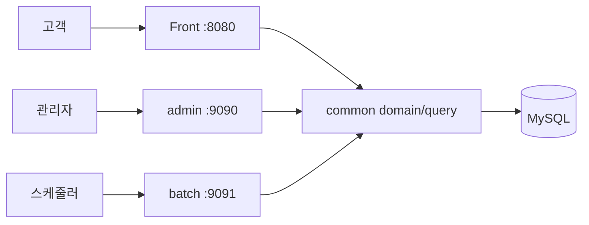

# Grade Stock

Grade Stock은 **상품 재고와 전시 정보를 중심으로 고객 탐색 화면과 관리자 운영 화면을 함께 구현한 커머스 플랫폼 프로젝트**입니다.

고객은 상품, 브랜드, 카테고리, 가격, 재고 상태를 조합해 상품을 탐색하고 상세 옵션과 연관 상품을 비교할 수 있습니다. 관리자는 같은 데이터를 기준으로 상품 전시, 주문, 콘텐츠, 회원과 운영 작업을 관리합니다.

현재 프론트는 실제 결제 서비스가 아닌 상품 탐색·재고 비교 데모 범위이며, 운영 기능과 배포 가능한 멀티 모듈 구조를 함께 검증하는 데 목적이 있습니다.

## 주요 기능

### 고객 화면

- 브랜드·카테고리·가격대·재고 상태 기반 상품 검색과 정렬
- 신규 드롭, 저재고 상품, 추천 상품과 인기 브랜드 노출
- 관리자가 게시한 공개 공지와 스타일 에디토리얼 검색·페이지 탐색·상세 열람
- 상품 상세 정보, 사이즈별 재고와 연관 상품 비교
- 관심 상품, 최근 본 상품, 비교 보드와 탐색 조건 저장
- 데스크톱·모바일 반응형 UI와 키보드 탐색 지원

### 관리자 화면

- 운영 현황과 재고·주문 지표 대시보드
- 상품, 브랜드, 카테고리와 프론트 전시 순위 관리
- 주문 상태, 배송 정보, 메모와 변경 이력 관리
- 배너, 콘텐츠, 회원, 운영 공지와 운영 작업 관리
- 실제 프론트 조회 이벤트 기반 콘텐츠 기간 추이·순 방문자·상위 문서·데이터 품질 분석
- 독자 도움됨·개선 필요 반응의 기간 추이·도움 비율·상위/개선 후보 분석과 CSV 내보내기
- 조회량과 독자 반응을 결합한 콘텐츠 효과·조치 우선순위 분석과 CSV 내보내기
- 효과 분석 결과의 운영 작업 전환, 중복 생성 방지와 원본 콘텐츠 양방향 이동
- 미연결 콘텐츠 조치 대상의 일괄 작업화와 신규·기존·제외 결과 집계
- 검색 조건 기반 CSV 내보내기와 활동 로그 조회
- 관리자 세션 인증, PBKDF2 비밀번호 해시와 역할별 접근 통제

### 운영 기반

- 운영 프로파일의 필수 DB 설정과 graceful shutdown
- 프로세스 생존 및 DB 준비 상태 헬스체크
- 최초 최고 관리자 환경변수 기반 생성
- 배치 활성화 여부와 실행 주기 환경변수 제어
- QueryDSL 단일 그룹 조회 기반 문서 일일 통계와 기간별 조회 분석
- 설정 기반 프론트 조회 이벤트 보존 기간 관리와 만료·고아 데이터 일괄 정리
- 배포 후 프론트·관리자·배치 smoke test

## 구조

```text
Toy/
├── Front/               고객용 화면과 카탈로그 API
├── admin/               관리자 화면과 운영 API
├── batch/               예약 작업 실행 애플리케이션
├── common/              공통 엔티티, Repository, QueryDSL 조회 구조
├── db/                  기능별 DB 반영 스크립트
├── docs/                운영 배포 문서
└── scripts/             배포 후 점검 스크립트
```

| 모듈 | 책임 | 기본 포트 |
| --- | --- | --- |
| `Front` | 고객용 상품 탐색, 상세 화면과 조회 API | `8080` |
| `admin` | 상품·주문·콘텐츠·회원·운영 설정 관리 | `9090` |
| `batch` | 문서 일일 통계·조회 이벤트 보존 등 명시적으로 활성화된 예약 작업 실행 | `9091` |
| `common` | 공통 도메인과 QueryDSL 기반 조회 계층 | 실행 모듈 아님 |

각 실행 모듈은 `common`을 의존하지만 프론트와 관리자는 서로 직접 의존하지 않습니다. 동일한 상품·주문 도메인을 공유하면서 화면별 서비스와 응답 DTO는 각 모듈에서 분리합니다.



## 기술 선택

- **Java 21 / Spring Boot 3.5.4**: 실행 모듈과 공통 도메인을 멀티 모듈로 구성합니다.
- **Spring Data JPA**: 엔티티 상태 변경과 트랜잭션 경계를 관리합니다.
- **OpenFeign QueryDSL 6.11**: 다중 검색 조건, 집계, 정렬과 페이징 조회를 타입 안전하게 분리합니다.
- **Thymeleaf / Vanilla JavaScript**: 별도 SPA 프레임워크 없이 서버 렌더링 화면과 비동기 API 흐름을 구성합니다.
- **MySQL**: 상품, 옵션, 주문, 콘텐츠와 운영 이력을 저장합니다.

## 로컬 실행

### 요구 사항

- JDK 21
- MySQL
- `new_toy` 데이터베이스와 필요한 스키마

### 환경 설정

```bash
export DB_URL='jdbc:mysql://127.0.0.1:3306/new_toy?serverTimezone=Asia/Seoul&characterEncoding=UTF-8'
export DB_USERNAME='root'
export DB_PASSWORD='your-password'
```

### 애플리케이션 실행

각 명령은 별도 터미널에서 실행합니다.

```bash
./gradlew :Front:bootRun
./gradlew :admin:bootRun
./gradlew :batch:bootRun
```

- 고객 화면: `http://localhost:8080`
- 관리자 화면: `http://localhost:9090/admin/login`
- 배치 헬스체크: `http://localhost:9091/health/live`

로컬 프로파일은 비어 있는 테이블에 화면 확인용 데이터를 생성합니다. 운영 프로파일에서는 로컬 데이터 시더가 실행되지 않습니다.

기존 문서가 있어 기본 시더가 동작하지 않는 로컬 DB에서는 공개 콘텐츠 화면 확인용 데이터를 선택적으로 추가할 수 있습니다. 스크립트는 기존 문서를 수정하지 않으며 반복 실행해도 같은 제목의 데이터가 중복 생성되지 않습니다.

```bash
mysql -h127.0.0.1 -uroot -p new_toy < db/front_content_highlights_demo.sql
```

공개 콘텐츠 조회수는 브라우저 식별자와 날짜를 기준으로 하루 한 번만 집계됩니다. 홈의 `이번 주 많이 읽은 콘텐츠`는 최근 7일 조회 이벤트와 순 방문자 수를 기준으로 공개·게시 완료 콘텐츠만 노출합니다. 콘텐츠 아카이브는 최신순·조회순·오래된순 정렬, 유형·검색어 필터, 페이지 크기와 URL 기반 탐색 복원을 지원합니다. 배포 전 조회 이벤트 테이블을 먼저 반영해야 하며, 최근 읽기 보드는 브라우저 로컬 저장소에 최대 6건만 보관합니다.

콘텐츠 상세는 동일 게시판의 이전·다음 공개 글, 예상 읽기 시간, 본문 진행률과 이어 읽기, 관심 저장, 90~120% 글자 크기 조절을 지원합니다. 콘텐츠 아카이브의 관심 보드에서는 최대 50건을 유형·읽기 상태와 함께 다시 확인하고 링크 복사, 개별 삭제, 전체 비우기를 수행할 수 있습니다. 개인 읽기 설정은 브라우저 저장소에만 보관되며 서버 회원 데이터에는 영향을 주지 않습니다.

```bash
mysql -h127.0.0.1 -uroot -p new_toy < db/front_content_view_event.sql
mysql -h127.0.0.1 -uroot -p new_toy < db/front_content_reaction.sql
```

콘텐츠 반응은 문서와 브라우저 방문자 키 조합당 한 건을 유지하며 `도움됐어요`와 `아쉬워요` 사이에서 변경할 수 있습니다. 반응 집계는 공개·게시 완료 콘텐츠에서만 제공되며 반응 스크립트는 최신 공개 콘텐츠에 화면 확인용 더미 데이터 3건을 멱등 추가합니다.

관리자 콘텐츠 목록의 `독자 반응 분석`은 현재 게시판과 조회 분석의 7·14·30일 기간을 공유합니다. 기간 내 마지막 선택 시각을 기준으로 현재 반응을 집계하며 도움 비율, 참여 방문자, 일별 활동, 반응 상위와 개선 필요 콘텐츠를 확인하거나 CSV로 내려받을 수 있습니다.

관리자 대시보드는 최근 7일 반응과 최우선 개선 콘텐츠를 운영 신호로 제공하고, 콘텐츠 상세는 해당 문서의 전체 누계와 7·30·90일 반응 활동을 분리해 보여줍니다. 반응 데이터 품질 진단은 삭제된 문서를 가리키는 고아 반응을 표시하지만 운영 데이터를 자동 삭제하지 않습니다.

## 테스트와 패키징

```bash
./gradlew test bootJar
```

실행 가능한 JAR는 `Front`, `admin`, `batch`의 `build/libs` 아래 생성됩니다. `common`은 실행 JAR가 아니라 세 모듈에 포함되는 라이브러리입니다.

배포된 세 애플리케이션의 헬스체크, 프론트 홈·카탈로그·상품 상세, 관리자 접근 통제를 한 번에 확인할 수 있습니다. 상세 검증 상품은 `FRONT_DETAIL_PRODUCT_ID` 환경변수로 변경할 수 있습니다.

```bash
./scripts/smoke-test.sh
```

운영 환경변수, 최초 관리자 생성, 실행 순서와 롤백 기준은 [운영 배포 가이드](docs/DEPLOYMENT.md)를 참고합니다.

## 상태 확인 API

| 경로 | 용도 |
| --- | --- |
| `/health/live` | 애플리케이션 프로세스 생존 확인 |
| `/health/ready` | DB 연결을 포함한 요청 처리 준비 확인 |

운영 load balancer는 `/health/ready`가 `200`인 인스턴스에만 트래픽을 전달해야 합니다.
모든 애플리케이션 응답은 로그 상관관계를 확인할 수 있도록 `X-Request-Id` 헤더를 제공합니다.
